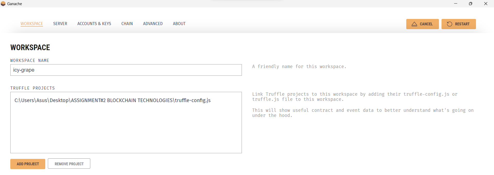

# AI Model Marketplace dApp

## Usage
Create a decentralized application that allows users to list, 
purchase, and rate AI models. The smart contract will manage the 
core functionality, while the frontend will provide an intuitive 
interface for users to interact with the contract.

List a new AI model:
Fill out the form with the model’s name, description, and price.
Click the “List Model” button to add the model to the marketplace.

Purchase a model:
Browse the list of available models.
Click the “Purchase” button next to the desired model.

Rate a purchased model:
Select a purchased model from your list.
Fill out the rating form and submit your rating.

View model details:
Click the “View Details” button next to any model to see its details.

Withdraw funds:
Model creators can withdraw their earnings by clicking the “Withdraw Funds” button.

## About Project


AI Model Marketplace is a dApp (decentralized application), which allows users to buy, sell and rate different AI models available on marketplace.

### Demo Screenshots


### Built With

* [HTML](https://html.spec.whatwg.org/)
* [css](https://www.w3.org/Style/CSS/)
* [Ganache](https://archive.trufflesuite.com/ganache/)
* [JavaScript](https://ecma-international.org/publications-and-standards/standards/ecma-262/)
* [REMIX IDE](https://remix.ethereum.org/)
* [Open Zeppelin](https://wizard.openzeppelin.com/#custom)
* [![MetaMask][MataMask]][MetaMask]

## Smart Contract Functions

```
listModel(string memory name, string memory description, uint256 price): Allows users to add a new AI model to the marketplace with a name, description, and price.

purchaseModel(uint256 modelId): Enables users to buy a specific AI model by its ID, transferring the payment to the model’s creator.

rateModel(uint256 modelId, uint8 rating): Lets users rate a purchased AI model, contributing to its overall rating score.

withdrawFunds(): Allows the contract owner to withdraw accumulated funds from model sales.

getModelDetails(uint256 modelId): Retrieves and returns the details of a specific AI model, including its name, description, price, creator, and average rating.
```

## Installation 

1. **Clone the repository**: 
``` bash 
git clone https://github.com/swagsouljaxxl/assignment2bct.git
cd ASSIGNMENT#2 BLOCKCHAIN TECHNOLOGIES 
```
2. **Install dependencies**:
```bash
npm install 
npm install viem
```
3. **Start Ganache**:
```bash
ganache-cli
```
4. **Compile and deploy smart contracts**:
```bash
truffle compile
truffle migrate --network development
```
5. **Connect smart contract in Ganache**:
- Go to Ganache application.
- Click on "Contracts" tab.
- Input `truffle-config.js` file.
- Save.



6. **Run the frontend**:
```bash
npm start 
[or]
lite-server
```
*lite-server will automatically create a webpage on localhost:3000 and allow people to connect to the website.